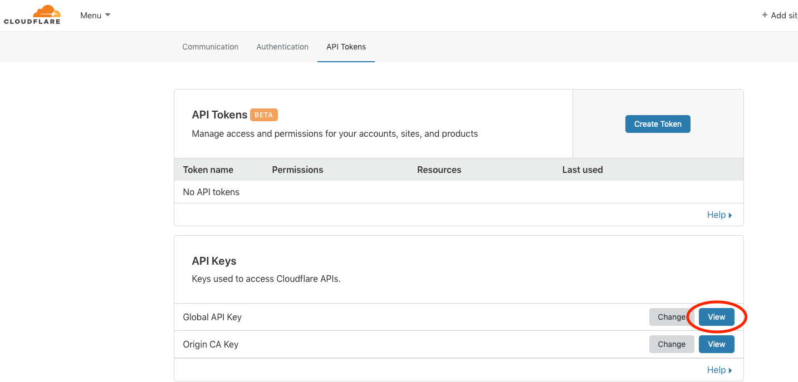
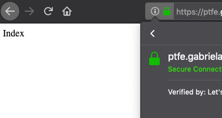

# ptfe-vagrant-valid-ssl
This repo provide an example of nginx configuration with FQDN and valid Letsencrypt certificate

# Description
- [vagrant box](#vagrant-box)
  - 4gb ram
  - preferable ubuntu OS
- DNS record for PTFE registered domain name (out case: ptfe.gabrielaelena.me) managed by [cloudflare.com](https://www.cloudflare.com/)
- get letsencrypt certificate
- configure nginx with certificate

## vagrant box usage

- start vagrant box
- connect to the vm

```bash
git clone git@github.com:andrewpopa/ptfe-vagrant-valid-ssl.git
cd ptfe-vagrant-valid-ssl
vagrant up
vagrant ssh
```

## create API credentials file

since we are using cloudflare DNS service for out letsencrypt. we need to install cloudflare plugin for certbot to be able to do verify DNS records

login to your cloudflare account and check your API token, go to:

My Profile -> API Tokens -> API Keys 

click on View (the key)



create a new file `cloudflare.ini` under `/vagrant` directory

copy API token from cloudflare to the file with your email address

```
dns_cloudflare_email = your-email-address
dns_cloudflare_api_key = api-token-from-your-account
```

## install dependencies

- install nginx
- install pip
- install cloudflare plugin for certbot

```bash
sudo apt-get install nginx
sudo apt-get install certbot
sudo apt-get install python-pip
sudo pip install certbot-dns-cloudflare
sudo pip install cryptography --upgrade
```

## request certificate

run `certbot` to request a certificate with cloudflare plugin

```bash
sudo certbot certonly \
  --dns-cloudflare \
  --dns-cloudflare-credentials /vagrant/cloudflare.ini \
  -d <your-domain-name>
```

you may have to answer some question which `certbot` will ask


```
Saving debug log to /var/log/letsencrypt/letsencrypt.log
Plugins selected: Authenticator dns-cloudflare, Installer None
Enter email address (used for urgent renewal and security notices) (Enter 'c' to
cancel): you-email-address@domain.com

- - - - - - - - - - - - - - - - - - - - - - - - - - - - - - - - - - - - - - - -
Please read the Terms of Service at
https://letsencrypt.org/documents/LE-SA-v1.2-November-15-2017.pdf. You must
agree in order to register with the ACME server at
https://acme-v02.api.letsencrypt.org/directory
- - - - - - - - - - - - - - - - - - - - - - - - - - - - - - - - - - - - - - - -
(A)gree/(C)ancel: A

- - - - - - - - - - - - - - - - - - - - - - - - - - - - - - - - - - - - - - - -
Would you be willing to share your email address with the Electronic Frontier
Foundation, a founding partner of the Let's Encrypt project and the non-profit
organization that develops Certbot? We'd like to send you email about our work
encrypting the web, EFF news, campaigns, and ways to support digital freedom.
- - - - - - - - - - - - - - - - - - - - - - - - - - - - - - - - - - - - - - - -
(Y)es/(N)o: N
Obtaining a new certificate
Performing the following challenges:
dns-01 challenge for example.com
Unsafe permissions on credentials configuration file: /vagrant/cloudflare.ini
Waiting 10 seconds for DNS changes to propagate
Waiting for verification...
Cleaning up challenges

IMPORTANT NOTES:
 - Congratulations! Your certificate and chain have been saved at:
   /etc/letsencrypt/live/example.com/fullchain.pem
   Your key file has been saved at:
   /etc/letsencrypt/live/example.com/privkey.pem
   Your cert will expire on 2019-11-06. To obtain a new or tweaked
   version of this certificate in the future, simply run certbot
   again. To non-interactively renew *all* of your certificates, run
   "certbot renew"
 - Your account credentials have been saved in your Certbot
   configuration directory at /etc/letsencrypt. You should make a
   secure backup of this folder now. This configuration directory will
   also contain certificates and private keys obtained by Certbot so
   making regular backups of this folder is ideal.
 - If you like Certbot, please consider supporting our work by:

   Donating to ISRG / Let's Encrypt:   https://letsencrypt.org/donate
   Donating to EFF:                    https://eff.org/donate-le
```

## configure nginx

create an `index.html` file

`echo "index" > /var/www/html/index.html`

```bash
cat ptfe.example.com.conf
server {
    listen 80;
    listen [::]:80;
    root /var/www/html;
    index index.html;
    server_name  example.com www.ptfe.example.com;

    listen 443 ssl;

    ssl_certificate /etc/letsencrypt/live/ptfe.example.com/fullchain.pem;
    ssl_certificate_key /etc/letsencrypt/live/ptfe.example.com/privkey.pem;

    # Redirect non-https traffic to https
    if ($scheme != "https") {
        return 301 https://$host$request_uri;
    }
}
```

## check your valid certificate

