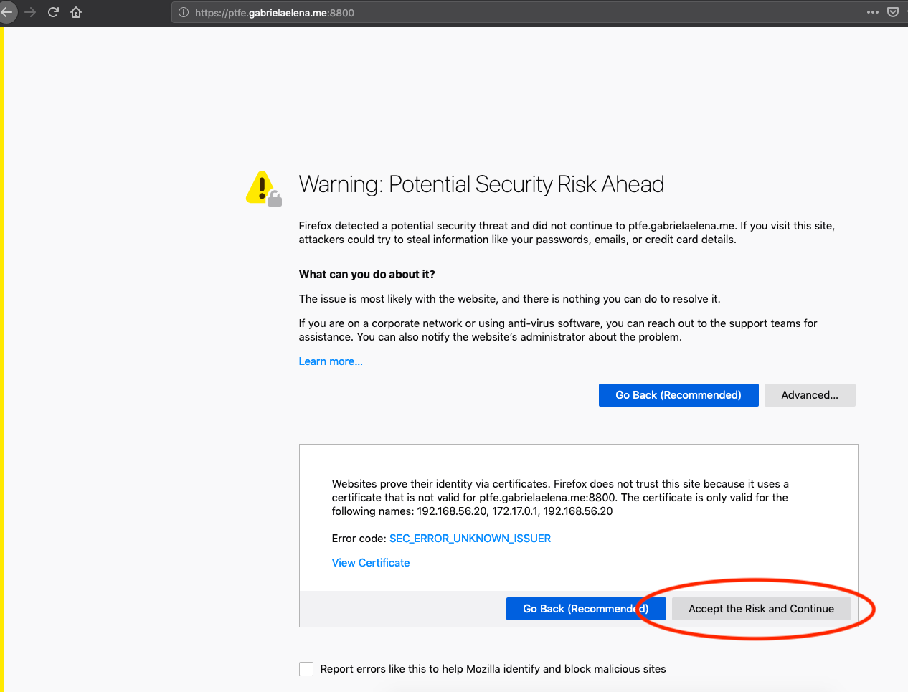
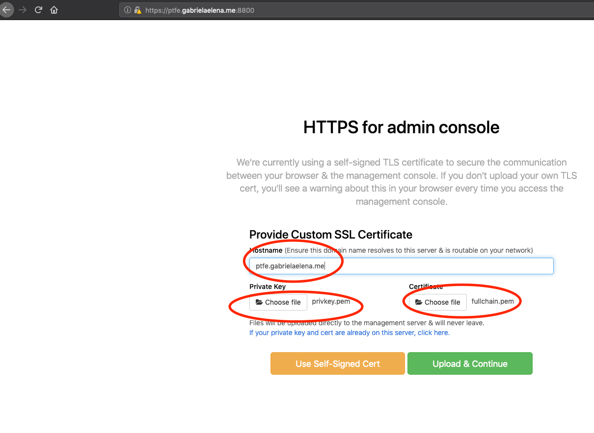
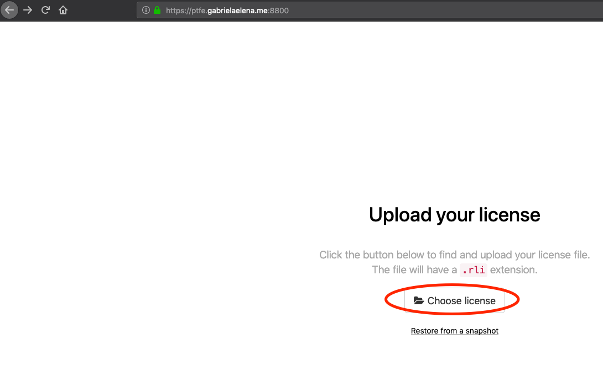
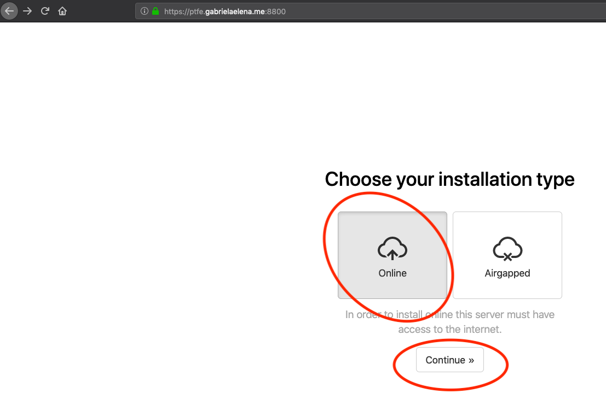
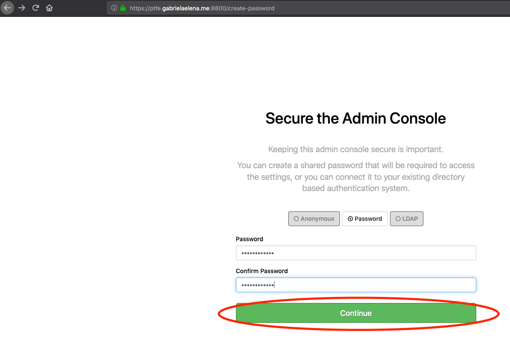
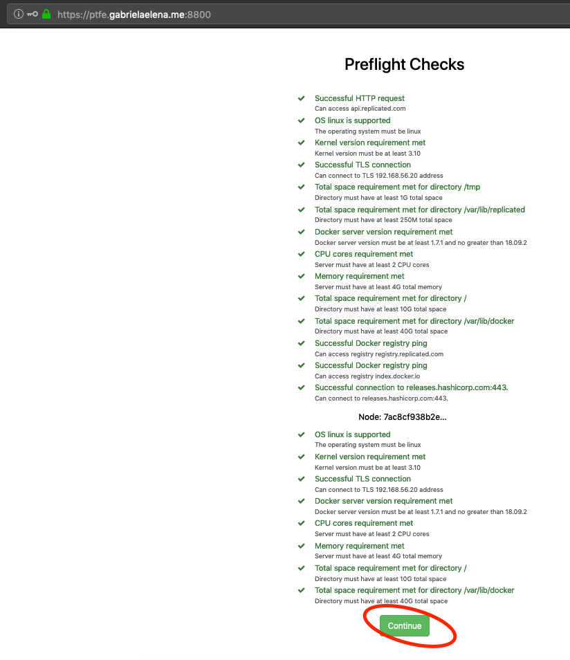
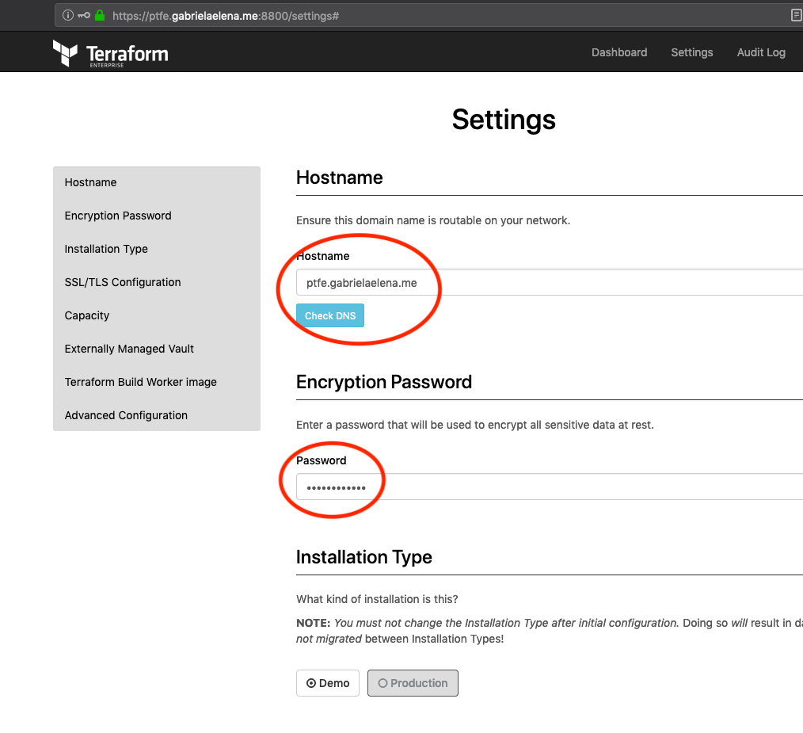
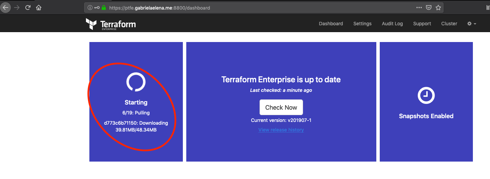
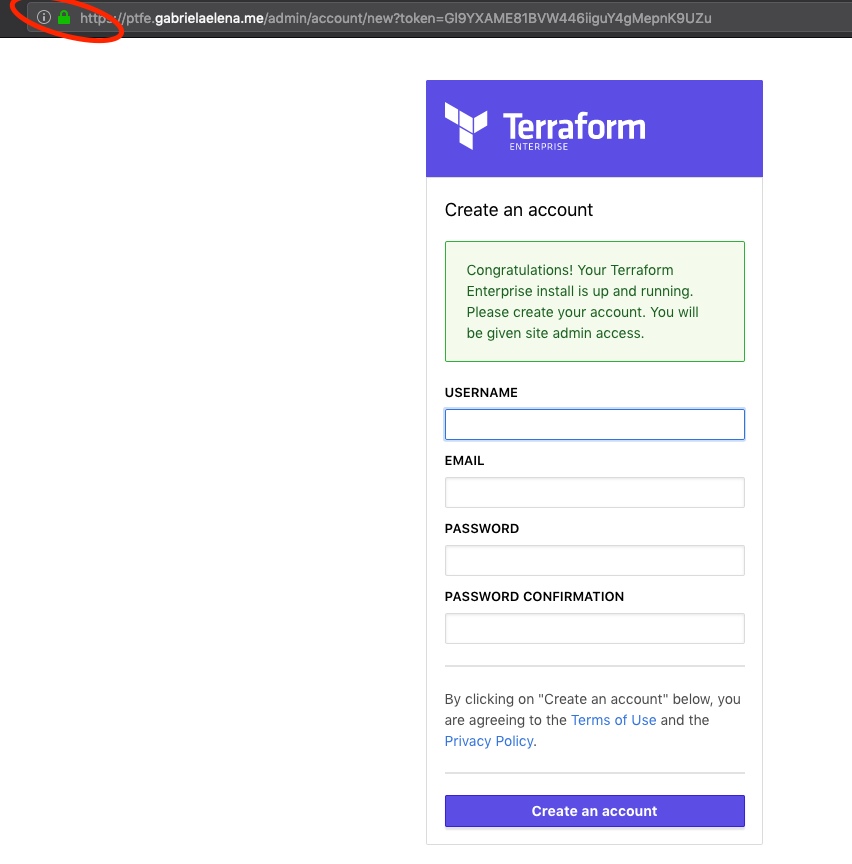

# ptfe-vagrant-valid-ssl
This repo provide an example of PTFE installation with FQDN and valid Letsencrypt certificate

# Prerequirements

- install [git](https://git-scm.com/downloads)
- have an account on [cloudflare](https://www.cloudflare.com/) with DNS zones
- install [vagrant](https://www.vagrantup.com/docs/installation/)
- [TFE](https://www.terraform.io/docs/enterprise/index.html)
- TFE License file (provided by HashiCorp)

# Description
- [vagrant box](#vagrant-box)
  - 4gb ram
  - preferable ubuntu OS
- DNS record for PTFE registered domain name (out case: ptfe.gabrielaelena.me) managed by [cloudflare.com](https://www.cloudflare.com/)
- get letsencrypt certificate

## vagrant box usage

- start vagrant box
- connect to the vm

```bash
git clone git@github.com:andrewpopa/ptfe-vagrant-valid-ssl.git
cd ptfe-vagrant-valid-ssl
vagrant up
vagrant ssh
```

## create API credentials file

since we are using cloudflare DNS service for out letsencrypt. we need to install cloudflare plugin for certbot to be able to do verify DNS records

login to your cloudflare account and check your API token, go to:

My Profile -> API Tokens -> API Keys 

click on View (the key)


create a new file `cloudflare.ini` under `/vagrant` directory

copy API token from cloudflare to the file with your email address

```
dns_cloudflare_email = your-email-address
dns_cloudflare_api_key = api-token-from-your-account
```

## install dependencies

- install pip
- install cloudflare plugin for certbot

```bash
sudo apt-get install certbot
sudo apt-get install python-pip
sudo pip install certbot-dns-cloudflare
sudo pip install cryptography --upgrade
```

## request certificate

run `certbot` to request a certificate with cloudflare plugin

```bash
sudo certbot certonly \
  --dns-cloudflare \
  --dns-cloudflare-credentials /vagrant/cloudflare.ini \
  -d <your-domain-name>
```

you may have to answer some question which `certbot` will ask


```
Saving debug log to /var/log/letsencrypt/letsencrypt.log
Plugins selected: Authenticator dns-cloudflare, Installer None
Enter email address (used for urgent renewal and security notices) (Enter 'c' to
cancel): you-email-address@domain.com

- - - - - - - - - - - - - - - - - - - - - - - - - - - - - - - - - - - - - - - -
Please read the Terms of Service at
https://letsencrypt.org/documents/LE-SA-v1.2-November-15-2017.pdf. You must
agree in order to register with the ACME server at
https://acme-v02.api.letsencrypt.org/directory
- - - - - - - - - - - - - - - - - - - - - - - - - - - - - - - - - - - - - - - -
(A)gree/(C)ancel: A

- - - - - - - - - - - - - - - - - - - - - - - - - - - - - - - - - - - - - - - -
Would you be willing to share your email address with the Electronic Frontier
Foundation, a founding partner of the Let's Encrypt project and the non-profit
organization that develops Certbot? We'd like to send you email about our work
encrypting the web, EFF news, campaigns, and ways to support digital freedom.
- - - - - - - - - - - - - - - - - - - - - - - - - - - - - - - - - - - - - - - -
(Y)es/(N)o: N
Obtaining a new certificate
Performing the following challenges:
dns-01 challenge for example.com
Unsafe permissions on credentials configuration file: /vagrant/cloudflare.ini
Waiting 10 seconds for DNS changes to propagate
Waiting for verification...
Cleaning up challenges

IMPORTANT NOTES:
 - Congratulations! Your certificate and chain have been saved at:
   /etc/letsencrypt/live/example.com/fullchain.pem
   Your key file has been saved at:
   /etc/letsencrypt/live/example.com/privkey.pem
   Your cert will expire on 2019-11-06. To obtain a new or tweaked
   version of this certificate in the future, simply run certbot
   again. To non-interactively renew *all* of your certificates, run
   "certbot renew"
 - Your account credentials have been saved in your Certbot
   configuration directory at /etc/letsencrypt. You should make a
   secure backup of this folder now. This configuration directory will
   also contain certificates and private keys obtained by Certbot so
   making regular backups of this folder is ideal.
 - If you like Certbot, please consider supporting our work by:

   Donating to ISRG / Let's Encrypt:   https://letsencrypt.org/donate
   Donating to EFF:                    https://eff.org/donate-le
```

## copy certificates 

copy all certificates to you `vagrant` folder, so you can upload during the installation process later

```bash
sudo mkdir /vagrant/ssl
sudo cp /etc/letsencrypt/live/ptfe.gabrielaelena.me/*.pem /vagrant/ssl
```

## execute the installer

run the installation script after login to vagrant box

```bash 
curl https://install.terraform.io/ptfe/stable | sudo bash
```
## specify lan network

choose the interface with the lan ip `192.168.56.20`

```bash
Determining local address
The installer was unable to automatically detect the private IP address of this machine.
Please choose one of the following network interfaces:
[0] enp0s3	10.0.2.15
[1] enp0s8	192.168.50.20
[2] docker0	172.17.0.1
Enter desired number (0-2): 1
```

This is where command line configuration end. The rest of configuration is need to be done via web interface.

## go to web browser

after the cli installation is done continue with web browser as it suggested

```bash
To continue the installation, visit the following URL in your browser:

  http://<this_server_address>:8800
```

you may have the following issue with accessing `https`. 

click on `Accept the Risk and Continue`



## use fqdn name for configuration

- set fqdn for this installation, use `https://ptfe.gabrielaelena.me:8800` in my case
- upload private key `privkey.pem`
- upload certificate `fullchain.pem`
- click - `Upload & Continue`



## upload license provided by HashiCorp

- click on choose license
- choose your file with licence from your pc



## choose installation mode

- click on online
- click on continue




## secure admin console

- write a password for the replicated console
> we will use this password later



## review preflight checks

- preflight should be all green
- click on continue



## encryption password and installation mode - demo in our case

add password for encryption, choose **Demo** mode of installation and don't forget to click **Save** and the end of the page (this information is not in screenshot :) )



## loading the configuration

wait until all components will be loaded



## Done

after loading of all components is done, you may open PTFE application and create new user.

please note that `padlock` is closed and we do have **Valid** certificate



Enjoy
